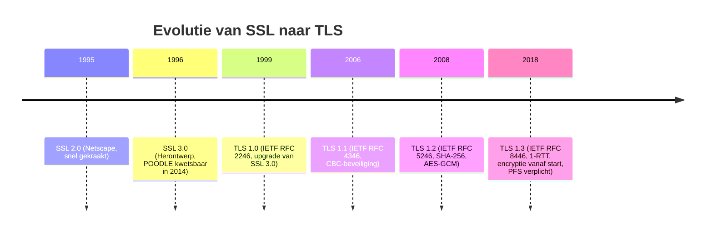
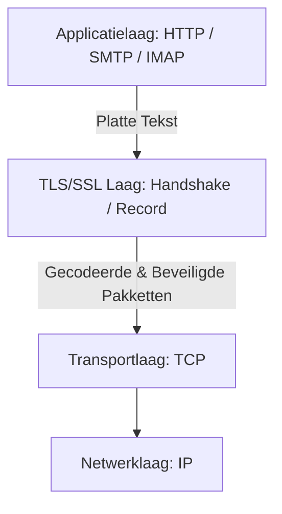
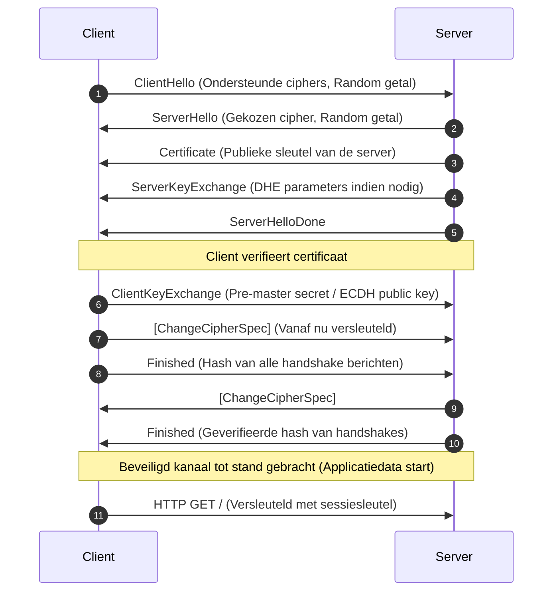
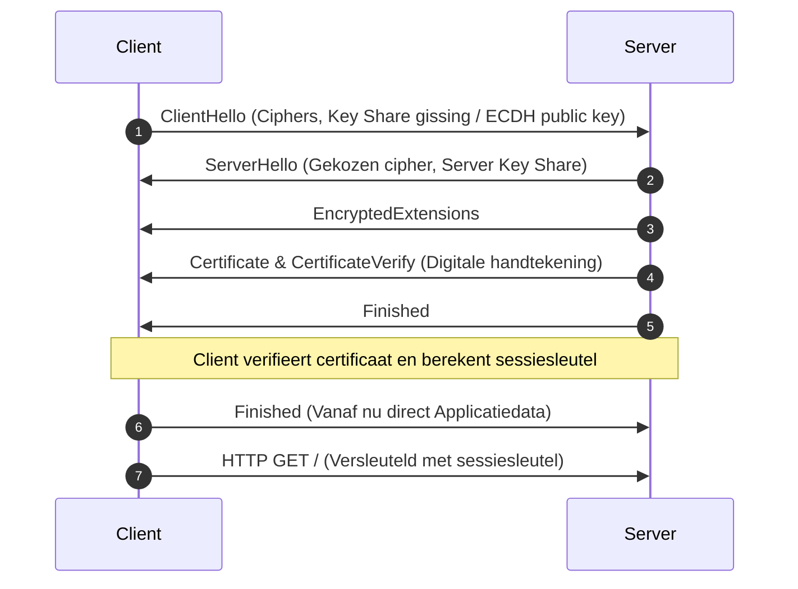

# Onderzoek naar encryptie bij TLS/SSL

In dit bestand wordt er onderzoek gedaan naar de encryptie die gebruikt wordt bij TLS/SSL. Ook de protocollen zelf worden besproken, inclusief de verschillende versies van het protocol, de gebruikte algoritmes en hun beveiligingsaspecten.

## Inhoudsopgave
1. [Wat is TLS & SSL en hoe werkt het?](#1-wat-is-tls--ssl-en-hoe-werkt-het)
2. [Waarvoor wordt TLS & SSL gebruikt en waarom is het belangrijk?](#2-waarvoor-wordt-tls--ssl-gebruikt-en-waarom-is-het-belangrijk)
3. [De verschillen en gelijkenissen tussen TLS en SSL](#3-de-verschillen-en-gelijkenissen-tussen-tls-en-ssl)
4. [Wat TLS & SSL te maken hebben met encryptie?](#4-wat-tls--ssl-te-maken-hebben-met-encryptie)
5. [De verschillende versies/generaties van TLS & SSL en hun kenmerken](#5-de-verschillende-versiesgeneraties-van-tls--ssl-en-hun-kenmerken)
6. [De evolutie van TLS & SSL door de jaren heen](#6-de-evolutie-van-tls--ssl-door-de-jaren-heen)
7. [De gebruikte encryptie-algoritmes en hun sterkte](#7-de-gebruikte-encryptie-algoritmes-en-hun-sterkte)
8. [De verschillende protocollen gebruikt bij TLS & SSL en hun beveiligingsaspecten](#8-de-verschillende-protocollen-gebruikt-bij-tls--ssl-en-hun-beveiligingsaspecten)
9. [De opbouw en werking van TLS & SSL](#9-de-opbouw-en-werking-van-tls--ssl)
10. [De opbouw van een TLS/SSL-verbinding en de handshake](#10-de-opbouw-van-een-tlsssl-verbinding-en-de-handshake)
11. [De beveiligingsrisico's en kwetsbaarheden van TLS & SSL](#11-de-beveiligingsrisicos-en-kwetsbaarheden-van-tls--ssl)
12. [De implementatie van TLS & SSL in verschillende software en systemen](#12-de-implementatie-of-tls--ssl-in-verschillende-software-en-systemen)
13. [De toekomst van TLS & SSL en de ontwikkelingen in encryptie](#13-de-toekomst-van-tls--ssl-en-de-ontwikkelingen-in-encryptie)

---

## 1. Wat is TLS & SSL en hoe werkt het?

**SSL (Secure Sockets Layer)** en zijn modernere opvolger **TLS (Transport Layer Security)** zijn cryptografische netwerkprotocollen die zijn ontworpen om veilige communicatie via een computernetwerk te garanderen. Het hoofddoel van deze protocollen is het bieden van drie fundamentele beveiligingspijlers (CIA-triade):

1. **Vertrouwelijkheid (Confidentiality):** De verzonden gegevens worden versleuteld met symmetrische encryptie, zodat derden die het netwerkverkeer onderscheppen de inhoud niet kunnen lezen.
2. **Integriteit (Integrity):** Gegevens kunnen tijdens de verzending niet ongemerkt worden aangepast. Dit wordt gecontroleerd via een *Message Authentication Code* (MAC) of een AEAD-cijfer.
3. **Authenticiteit (Authenticity):** De identiteit van de communicerende partijen (meestal de server) wordt geverifieerd aan de hand van digitale certificaten, uitgegeven door vertrouwde certificaatautoriteiten (CAs).

### Werking op hoofdlijnen
Wanneer een client (bijvoorbeeld een webbrowser) verbinding maakt met een server (bijvoorbeeld een webserver):
* Initieert de client de verbinding en stelt een set ondersteunde cryptografische opties voor (*Cipher Suites*).
* Bewijst de server zijn identiteit door zijn digitale certificaat te sturen.
* Voeren beide partijen een sleuteluitwisseling (*Key Exchange*) uit om een gedeelde, geheime symmetrische sessiesleutel te genereren.
* Wordt alle verdere communicatie versleuteld met deze tijdelijke sessiesleutel.

---

## 2. Waarvoor wordt TLS & SSL gebruikt en waarom is het belangrijk?

TLS/SSL vormt het fundament van de beveiliging op het moderne internet. Het wordt onder andere gebruikt voor:

* **HTTPS (HyperText Transfer Protocol Secure):** Veilig surfen op het web. Vrijwel alle websites maken tegenwoordig gebruik van HTTPS om inloggegevens, persoonsgegevens en creditcardinformatie te beschermen.
* **Beveiligde E-mail:** Protocollen zoals SMTPS, IMAPS en POP3S gebruiken TLS om e-mailverkeer tussen clients en servers te versleutelen.
* **Virtual Private Networks (VPN):** TLS-gebaseerde VPN's (zoals OpenVPN) creëren veilige tunnels over openbare netwerken.
* **Bestandsoverdracht:** FTPS (FTP over TLS) en SFTP.
* **Databaseverbindingen:** Het beveiligen van verbindingen tussen applicatieservers en databases (bijv. PostgreSQL, MySQL).

### Waarom is het belangrijk?
* **Bescherming tegen afluisteren (Eavesdropping):** Voorkomt dat aanvallers op openbare wifi-netwerken wachtwoorden of privégegevens stelen.
* **Voorkomen van Man-in-the-Middle (MitM) aanvallen:** Zonder authenticatie zou een aanvaller zich kunnen voordoen als de bank of webwinkel. TLS voorkomt dit door middel van cryptografische identiteitscontrole.
* **Privacy en Wetgeving:** Voldoen aan strikte privacywetgeving zoals de AVG (GDPR) en standaarden zoals PCI-DSS.
* **Gebruikersvertrouwen en SEO:** Zoekmachines zoals Google geven de voorkeur aan HTTPS-sites, en browsers waarschuwen gebruikers expliciet wanneer een verbinding niet beveiligd is.

---

## 3. De verschillen en gelijkenissen tussen TLS en SSL

Hoewel de termen "SSL" en "TLS" in de praktijk vaak door elkaar worden gebruikt (bijvoorbeeld bij "SSL-certificaten"), is er een belangrijk historisch en technisch onderscheid.

### Gelijkenissen
* Beide protocollen lossen exact hetzelfde probleem op: het beveiligen van transportkanalen.
* Ze maken allebei gebruik van een tweedelig proces: een asymmetrische handshake om een symmetrische sleutel af te spreken, gevolgd door symmetrisch versleutelde datatransmissie.
* Ze maken gebruik van een Public Key Infrastructure (PKI) met certificaten.

### Verschillen
* **Eigendom en Standaardisatie:** SSL is oorspronkelijk ontwikkeld door Netscape. TLS is de officiële standaard van de Internet Engineering Task Force (IETF) vanaf TLS v1.0.
* **Cryptografische Algoritmes:** TLS introduceerde sterkere cryptografische basiselementen. TLS v1.0 verving bijvoorbeeld de zwakkere Key Derivation Function (KDF) van SSL v3.0 door een op HMAC gebaseerde pseudorandom functie (PRF).
* **Waarschuwingen (Alerts):** TLS introduceerde specifiekere foutmeldingen (alerts) tijdens de handshake.
* **Veiligheidsstatus:** Alle versies van SSL (1.0, 2.0, 3.0) zijn inmiddels **volledig onveilig** verklaard en uitgefaseerd. Moderne systemen accepteren alleen nog TLS-verbindingen.

| Kenmerk | SSL (v2.0, v3.0) | TLS (v1.0 - v1.3) |
| :--- | :--- | :--- |
| **Ontwikkelaar** | Netscape | IETF |
| **Status** | Volledig verouderd en onveilig | Actueel en veilig (vanaf v1.2) |
| **Sleutelafleiding** | Ad-hoc methode | Gestandaardiseerde PRF / HKDF |
| **MAC-authenticatie** | Eenvoudige MAC | Sterke HMAC of AEAD-ciphers |

---

## 4. Wat TLS & SSL te maken hebben met encryptie?

TLS/SSL is zelf geen specifiek encryptie-algoritme, maar een **raamwerk/orkestratieprotocol** dat verschillende cryptografische mechanismen samenbrengt. Het combineert de sterke punten van zowel asymmetrische als symmetrische encryptie:

### Asymmetrische encryptie (Public Key Cryptografie)
* **Gebruik:** Tijdens de initiële handshake.
* **Doel:** 
  1. Het verifiëren van de identiteit van de server (authenticatie via digitale handtekeningen).
  2. Het veilig uitwisselen van een gemeenschappelijk geheim (sleuteluitwisseling) zonder dat een afluisteraar dit kan berekenen.
* **Waarom niet voor alles?** Asymmetrische cryptografie is rekenkundig erg zwaar en traag. Het is ongeschikt voor het versleutelen van grote hoeveelheden data.

### Symmetrische encryptie (Secret Key Cryptografie)
* **Gebruik:** Na de succesvolle handshake voor de feitelijke datastroom.
* **Doel:** Het snel en efficiënt versleutelen en ontsleutelen van de bulk-data.
* **Waarom hier wel?** Symmetrische algoritmes zijn extreem snel en kunnen in hardware (zoals AES-NI instructies op moderne CPU's) worden versneld.

### Hashing en Message Authentication Codes (MAC)
* **Gebruik:** Continu tijdens de verbinding.
* **Doel:** Het waarborgen van data-integriteit. Elke pakket bevat een cryptografische controlewaarde waarmee de ontvanger kan verifiëren dat de data onderweg niet is gewijzigd.

---

## 5. De verschillende versies/generaties van TLS & SSL en hun kenmerken

De evolutie van transportbeveiliging heeft geleid tot verschillende versies van de protocollen:

### SSL-generaties (Verouderd)
* **SSL 1.0:** Nooit publiekelijk uitgebracht vanwege ernstige kwetsbaarheden in het ontwerp.
* **SSL 2.0:** Uitgebracht in 1995. Had ernstige ontwerpfouten (zoals de mogelijkheid om handshake-berichten te manipuleren en zwakke export-ciphers). Snel opgevolgd.
* **SSL 3.0:** Uitgebracht in 1996. Lange tijd de standaard, maar in 2014 definitief gebroken door de **POODLE**-aanval. Sindsdien universeel uitgeschakeld.

### TLS-generaties (Actueel/Historisch)
* **TLS 1.0 (1999):** Gepubliceerd als RFC 2246. Was een bescheiden upgrade van SSL 3.0. Bevat bekende zwakheden zoals vatbaarheid voor de **BEAST**-aanval. Officieel afgeraden sinds 2021.
* **TLS 1.1 (2006):** Gepubliceerd als RFC 4346. Voegde bescherming toe tegen CBC-aanvallen (zoals explicit IVs). Inmiddels ook afgeraden en grotendeels uitgeschakeld.
* **TLS 1.2 (2008):** Gepubliceerd als RFC 5246. De meest flexibele en nog steeds zeer breed gedragen versie. Introduceerde ondersteuning voor geavanceerde cipher suites (zoals AES-GCM), flexibele hashing-algoritmes (SHA-256) en verving de oude MD5/SHA-1 PRF.
* **TLS 1.3 (2018):** Gepubliceerd als RFC 8446. De huidige gouden standaard. Het is een radicale herziening gericht op **snelheid** en **maximale veiligheid**:
  * **Snellere Handshake:** Verminderd van 2 round-trips (2 RTT) naar slechts 1 round-trip (1 RTT), en ondersteunt *0-RTT (Zero Round Trip Time)* voor terugkerende clients.
  * **Verhoogde Veiligheid:** Alle verouderde en potentieel zwakke algoritmes (zoals RC4, Triple DES, MD5, SHA-1, statische RSA-sleuteluitwisseling) zijn volledig verwijderd.
  * **Verplichte Perfect Forward Secrecy (PFS):** Statische sleuteluitwisselingen zijn verboden. Alleen efemere (tijdelijke) sleuteluitwisselingen zoals ECDHE en DHE zijn toegestaan.

---

## 6. De evolutie van TLS & SSL door de jaren heen

De onderstaande tijdlijn en tabel laten de overgang zien van vroege, kwetsbare Netscape-protocollen naar de strakke, snelle standaarden van de IETF vandaag de dag.



---

## 7. De gebruikte encryptie-algoritmes en hun sterkte

Bij het opzetten van een TLS-verbinding onderhandelen de client en server over een specifieke combinatie van algoritmes, de zogenaamde **Cipher Suite**. In TLS 1.2 ziet een cipher suite er bijvoorbeeld als volgt uit:
`TLS_ECDHE_RSA_WITH_AES_256_GCM_SHA384`

Dit geeft aan hoe elk onderdeel van de verbinding cryptografisch wordt afgehandeld. Hieronder bespreken we deze onderdelen en leggen we de link naar de aanbevolen algoritmes uit de [overzichtslijst van encryptie-algoritmes](lijst.md).

### A. Sleuteluitwisseling (Key Exchange) & Perfect Forward Secrecy
Sleuteluitwisseling zorgt ervoor dat de client en server een gedeeld geheim (*pre-master secret*) afspreken waaruit de symmetrische sessiesleutels worden afgeleid.

* **Statische RSA:** (Niet meer toegestaan in TLS 1.3). De client versleutelt het geheim met de publieke sleutel van de server. Kwetsbaarheid: als de private key van de server in de toekomst lekt, kan een aanvaller alle eerder opgenomen netwerkstromen ontsleutelen. Dit mist **Perfect Forward Secrecy (PFS)**.
* **Diffie-Hellman Ephemeral (DHE):** Gebaseerd op discrete logaritmes ($g^{ab} \pmod p$). Biedt PFS omdat voor elke sessie nieuwe, tijdelijke sleutels worden gegenereerd. Zie [Diffie-Hellman (DH)](lijst.md#gebaseerd-op-discrete-logaritmes).
* **Elliptic Curve Diffie-Hellman Ephemeral (ECDHE):** De moderne standaard. Maakt gebruik van elliptische krommen voor wiskundige efficiëntie, wat resulteert in veel kleinere sleutels voor dezelfde cryptografische sterkte. Zie [ECDH](lijst.md#gebaseerd-op-elliptische-krommen-elliptic-curve-cryptography-ecc). Curve25519 (X25519) wordt hierbij sterk aanbevolen vanwege zijn uitstekende prestaties en weerstand tegen side-channel aanvallen.
* **Post-Quantum Sleuteluitwisseling (PQC):** Om bestand te zijn tegen de toekomstige dreiging van quantumcomputers, implementeren moderne browsers en servers inmiddels hybride sleuteluitwisselingen zoals **X25519Kyber768**. Dit combineert traditionele ECDH met het quantum-resistente Kyber-algoritme. Zie [Kyber (ML-KEM)](lijst.md#post-quantum-cryptografie-pqcrypto).

### B. Authenticatie & Digitale Handtekeningen
Dit onderdeel zorgt ervoor dat de client kan controleren of het certificaat daadwerkelijk van de legitieme servereigenaar is.

* **RSA:** Nog steeds de meest gebruikte methode voor digitale handtekeningen op basis van priemfactorisatie. Vereist relatief grote sleutels (minimaal 2048-bit, bij voorkeur 4096-bit) om veilig te blijven. Zie [RSA](lijst.md#gebaseerd-op-integer-factorisatie-priemfactorisatie).
* **ECDSA (Elliptic Curve Digital Signature Algorithm):** Biedt dezelfde veiligheid als RSA maar met veel kleinere sleutels (bijv. 256-bit in plaats van 3078-bit RSA), wat zorgt voor snellere handshakes en minder netwerkoverhead. Zie [ECDSA](lijst.md#gebaseerd-op-elliptische-krommen-elliptic-curve-cryptography-ecc).
* **Ed25519 (EdDSA):** Een modernere variant van ECDSA gebaseerd na de Edwards-curve Curve25519. Ed25519 is sneller, veiliger en minder gevoelig voor slechte random number generators. Zie [Ed25519](lijst.md#gebaseerd-op-elliptische-krommen-elliptic-curve-cryptography-ecc).

### C. Symmetrische Bulk Encryptie (Data-encryptie)
Dit algoritme versleutelt de daadwerkelijke payload (bijv. de HTML, CSS en API-antwoorden). In moderne TLS-versies worden uitsluitend **AEAD (Authenticated Encryption with Associated Data)** ciphers gebruikt, die encryptie en integriteitscontrole in één stap combineren.

* **AES-GCM (Advanced Encryption Standard in Galois/Counter Mode):** De absolute industriestandaard. AES is een block cipher die in GCM-modus extreem veilig is en door ingebouwde hardware-acceleratie (AES-NI) op moderne processors vrijwel geen merkbare vertraging veroorzaakt. Zie [AES](lijst.md#symmetrische-encryptie). Gewoonlijk gebruikt met een sleutellengte van 128 of 256 bits (AES-256-GCM is de veiligste keuze).
* **ChaCha20-Poly1305:** Een stream cipher gecombineerd met een Poly1305 authenticator. Dit is een uitstekend en veilig alternatief voor AES, met name op apparaten die geen hardware-acceleratie voor AES hebben (zoals oudere smartphones of IoT-apparaten). Zie [ChaCha20-Poly1305](lijst.md#stream-ciphers).

### D. Hashfuncties (Integriteit & Key Derivation)
Hashfuncties worden gebruikt voor het genereren van berichtsamenvattingen en binnen de Key Derivation Functions (KDF) om sessiesleutels af te leiden.

* **SHA-1 / MD5:** Volledig verouderd en onveilig verklaard wegens botsingskwetsbaarheden (collisions). Uitgesloten in moderne TLS.
* **SHA-2 Familie (SHA-256, SHA-384):** De huidige veilige standaard binnen TLS 1.2 en TLS 1.3 voor handtekeningverificatie en sleutelafleiding (HKDF). Zie [SHA-2](lijst.md#cryptografische-hashfuncties).

---

## 8. De verschillende protocollen gebruikt bij TLS & SSL en hun beveiligingsaspecten

TLS is niet één enkel protocol, maar is opgebouwd uit een set van vier nauw samenwerkende sub-protocollen die zich bevinden op de transportlaag:

```
+-----------------------------------------------------------------------------+
|                               Applicatielaag (HTTP, SMTP, FTP, etc.)         |
+-----------------------------------------------------+-----------------------+
|  Handshake Protocol  | Change Cipher Spec | Alert   | Record Protocol       |
+----------------------+--------------------+---------+-----------------------+
|                               Transportlaag (TCP)                           |
+-----------------------------------------------------------------------------+
```

### 1. TLS Handshake Protocol
Dit is het meest complexe sub-protocol. Het voert de authenticatie uit en onderhandelt over de te gebruiken cryptografische parameters en sleutels.
* **Beveiligingsaspect:** Het moet bestand zijn tegen downgrade-aanvallen (waarbij een aanvaller probeert de client te dwingen een zwakker algoritme te kiezen). Dit wordt opgelost door aan het eind van de handshake een cryptografisch getekend overzicht van alle handshakeberichten (*Finished* bericht) uit te wisselen.

### 2. TLS Record Protocol
Dit protocol ontvangt data van de applicatielaag, fragmenteert deze in hanteerbare blokken (records), past optioneel compressie toe (tegenwoordig uitgeschakeld), berekent de MAC/handtekening voor integriteit, versleutelt de data en stuurt het resultaat naar de TCP-laag.
* **Beveiligingsaspect:** Sinds de ontdekking van compressie-aanvallen (zoals CRIME) is datacompressie op Record-niveau standaard uitgeschakeld.

### 3. TLS Alert Protocol
Dit protocol wordt gebruikt om fouten of statuswijzigingen te communiceren naar de tegenpartij. Berichten hebben twee niveaus:
* *Warning:* Wijst op een probleem, maar de verbinding kan eventueel openblijven.
* *Fatal:* Sluit de verbinding onmiddellijk af om lekken van gegevens te voorkomen (bijv. bij een ongeldig certificaat of mislukte MAC-verificatie).

### 4. TLS Change Cipher Spec Protocol
Een zeer eenvoudig protocol bestaande uit één byte. In TLS 1.2 en lager gaf dit aan dat de zender vanaf dat moment overgaat op de zojuist afgesproken encryptie-instellingen.
* **Beveiligingsaspect:** In TLS 1.3 is dit protocol overbodig gemaakt omdat de handshake zelf al vanaf een veel eerder stadium versleuteld is. Het wordt in TLS 1.3 soms nog als dummy-bericht meegestuurd voor neerwaartse compatibiliteit met firewalls (middleboxes) die anders de verbinding zouden verbreken.

---

## 9. De opbouw en werking van TLS & SSL

In het OSI-referentiemodel bevindt TLS zich direct boven de Transportlaag (Layer 4, TCP) en direct onder de Applicatielaag (Layer 7, HTTP). Hierdoor wordt TLS vaak aangeduid als een **Layer 4.5 of Layer 5 (Sessielaag)** protocol.

Het grote voordeel hiervan is dat TLS volledig transparant is voor de applicatielaag. Een applicatieprotocol zoals HTTP hoeft niet te weten *hoe* de encryptie werkt; het stuurt simpelweg platte tekst naar de TLS-socket, die de data transparant versleutelt voordat het over TCP wordt verzonden.



---

## 10. De opbouw van een TLS/SSL-verbinding en de handshake

De handshake is de procedure waarmee client en server een beveiligde sessie opzetten. Hieronder vergelijken we de klassieke TLS 1.2 handshake met de sterk geoptimaliseerde TLS 1.3 handshake.

### TLS 1.2 Handshake (2 RTT - Round Trip Times)
De TLS 1.2 handshake vereist twee volledige netwerk-roundtrips voordat de applicatiedata veilig verzonden kan worden.



### TLS 1.3 Handshake (1 RTT)
In TLS 1.3 speculeert de client direct op het sleuteluitwisselingsalgoritme (meestal ECDHE met Curve25519) en stuurt zijn sleutelaandeel (*Key Share*) meteen mee in het eerste bericht. Dit halveert de latentie.



---

## 11. De beveiligingsrisico's en kwetsbaarheden van TLS & SSL

Door de jaren heen zijn er talloze aanvallen uitgevoerd op TLS/SSL. Deze kunnen grofweg worden ingedeeld in protocolfouten, cryptografische zwakheden en implementatiefouten.

### A. Protocol- en Cryptografische Aanvallen
* **POODLE (2014):** Richtte zich op SSL 3.0. Maakte misbruik van de manier waarop CBC-encryptie padding controleert, waardoor een actieve aanvaller (MitM) byte voor byte cookies of sessietokens kon ontsleutelen.
* **BEAST (2011):** Misbruikte een zwakte in de Initialisatie Vector (IV) van CBC-ciphers in TLS 1.0 om HTTPS-sessies te kapen.
* **LOGJAM & FREAK (2015):** Dwangmatige downgrade-aanvallen waarbij de client werd gedwongen om verouderde, opzettelijk verzwakte cryptografie uit de jaren '90 te gebruiken (*Export-grade cryptography*), die eenvoudig gekraakt kon worden door moderne hardware.
* **Downgrade Attacks:** Een actieve MitM-aanvaller manipuleert de initiële TCP-pakketten zodat de client en server denken dat de andere partij alleen verouderde protocollen (zoals TLS 1.0) ondersteunt, om vervolgens bekende kwetsbaarheden in die oudere protocollen uit te buiten.

### B. Bekende Implementatiefouten
Dit zijn geen zwakheden in het TLS-protocol zelf, maar fouten in de softwarecode die het protocol implementeert.
* **Heartbleed (2014):** Een catastrofale bug in de OpenSSL-bibliotheek. Door een ontbrekende bounds-check in de TLS Heartbeat-extensie kon een aanvaller willekeurig geheugensegmenten van de server uitlezen. Dit gaf direct toegang tot private keys, gebruikerswachtwoorden en sessietokens.

---

## 12. De implementatie of TLS & SSL in verschillende software en systemen

Er zijn verschillende bibliotheken en engines beschikbaar die TLS-functionaliteit aanbieden voor besturingssystemen en applicaties:

* **OpenSSL:** De meest gebruikte open-source cryptografische bibliotheek ter wereld. Wordt standaard gebruikt in Linux, Apache en Nginx. Het is extreem krachtig maar heeft historisch gezien een complexe en foutgevoelige codebase.
* **Rustls:** Een moderne, in Rust geschreven TLS-bibliotheek. Rustls is ontworpen om veiliger te zijn dan OpenSSL door gebruik te maken van de geheugenveiligheidsgaranties van de programmeertaal Rust. Het sluit veelvoorkomende bugs (zoals buffer overflows en use-after-free) volledig uit.
* **BoringSSL:** Google's fork van OpenSSL. Ontworpen voor intern gebruik in Chrome, Android en Google Cloud-infrastructuur. Het verwijdert veel onnodige legacy-features om het aanvalsoppervlak te verkleinen.
* **LibreSSL:** Een fork van OpenSSL door het OpenBSD-project, gestart direct na de ontdekking van Heartbleed. Doel is het opschonen van de verouderde OpenSSL-codebase en het verbeteren van de veiligheid.
* **Schannel (Secure Channel):** De ingebouwde TLS-implementatie van Microsoft Windows, gebruikt door IIS en Internet Explorer/Edge.

---

## 13. De toekomst van TLS & SSL en de ontwikkelingen in encryptie

De wereld van cryptografie staat nooit stil. Verschillende grote ontwikkelingen zullen de komende jaren bepalend zijn voor de toekomst van transportbeveiliging.

### Post-Quantum Cryptografie (PQC)
De grootste dreiging voor de huidige cryptografie is de komst van een cryptografisch relevante quantumcomputer (CRQC). Volgens het algoritme van Shor kunnen quantumcomputers asymmetrische algoritmes zoals RSA, DH en ECC (ECDH/ECDSA) in theorie binnen enkele minuten kraken.

Om dit voor te zijn, is de overstap naar **Post-Quantum Cryptografie** gestart:
* **Sleuteluitwisseling:** Traditionele sleuteluitwisselingen worden vervangen door lattice-gebaseerde mechanismen zoals **Kyber (ML-KEM)**. Zie [Kyber (ML-KEM) in lijst.md](lijst.md#post-quantum-cryptography-pqc).
* **Handtekeningen:** Certificaten zullen in de toekomst worden ondertekend met quantum-resistente algoritmes zoals **Dilithium (ML-DSA)**. Zie [Dilithium (ML-DSA) in lijst.md](lijst.md#post-quantum-cryptography-pqc).

### Encrypted Client Hello (ECH)
Zelfs bij een volledig versleutelde TLS 1.3-verbinding is het eerste bericht van de client (de *ClientHello*) onversleuteld. Dit bericht bevat de **Server Name Indication (SNI)**, oftewel de hostnaam van de website die de gebruiker bezoekt (bijvoorbeeld `bank.nl`). Hierdoor kunnen internetproviders of kwaadwillenden op het lokale netwerk nog steeds zien welke websites je bezoekt.

**ECH (Encrypted Client Hello)** is een extensie die de SNI versleutelt met een publieke sleutel die via DNS (beveiligd met DNS-over-HTTPS) wordt opgehaald. Dit verbetert de privacy van de gebruiker aanzienlijk.

### Volledige uitfasering van legacy
Overheden en security-instanties dwingen wereldwijd de volledige stopzetting af van TLS 1.0 en TLS 1.1. In de nabije toekomst zal TLS 1.2 ook langzaam naar de achtergrond verdwijnen ten gunste van het veel veiligere en snellere TLS 1.3.

